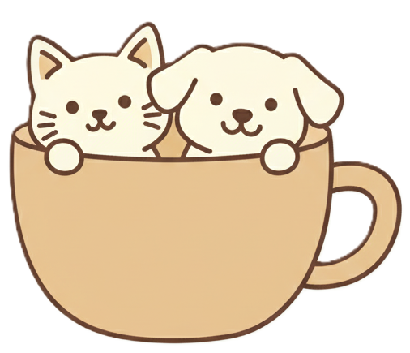

# 3 - Café com Animaizinhos

Café com animaizinhos

---

## Sobre o Projeto
Este é um site fictício criado na terceira semana para o Code 4 causes. Ele tem o intuito de divulgar um evento muito especial: um **Cat Café Solidário**.

---

## ☕🐱 O que é um Cat Café?
Um Cat Café é um espaço onde pessoas podem relaxar, tomar café e ao mesmo tempo **interagir com gatos em um ambiente seguro e aconchegante**.
No caso deste projeto, além de curtir a companhia felina e canina, os visitantes estarão ajudando diretamente na **causa animal**.  

---

## 🎯 Objetivos do Site
- Divulgar o evento do Cat Café Solidário.  
- Apresentar os animais disponíveis para interação e adoção.  
- Informar sobre a missão e os valores da ONG.  
- Facilitar doações para manter o projeto de resgate e adoção de animais.